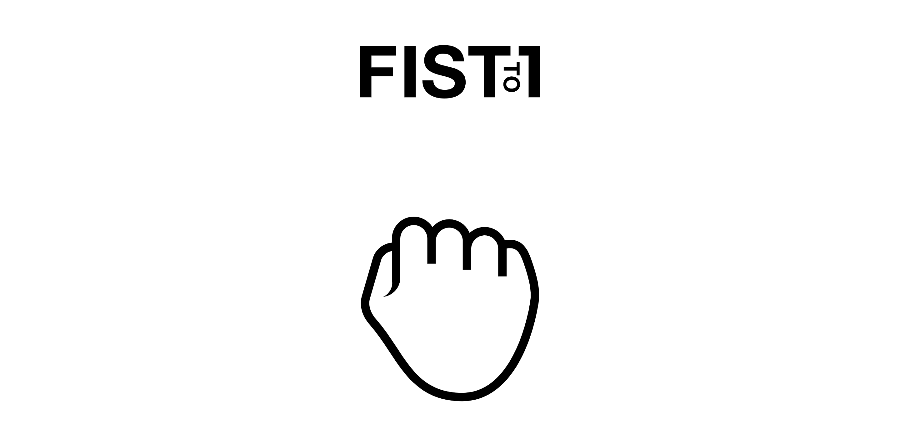
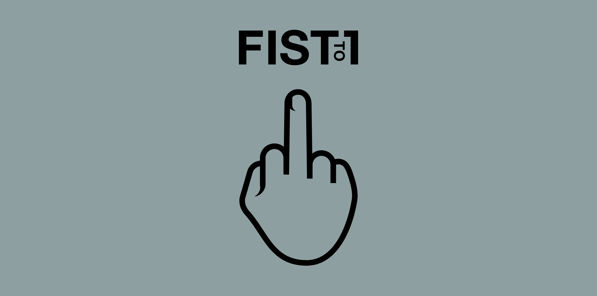
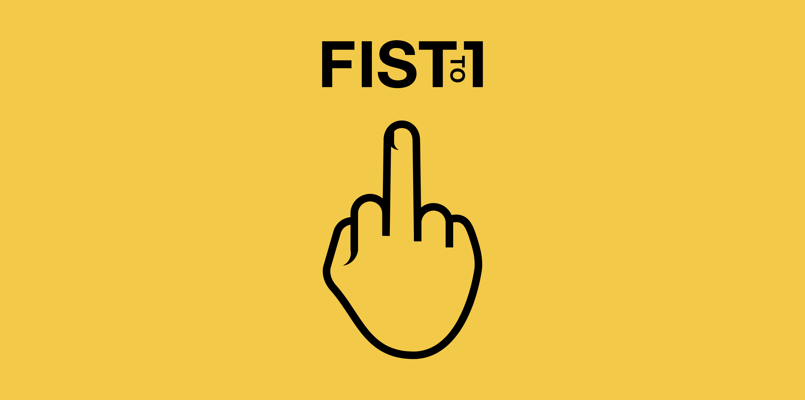

# Fist To One

In classes at Turing School of Software & Design, our teachers would perform comprehension checks during lessons called Fist To Five. Everyone in the class raised their fist an indicated with a number of fingers their level of understanding, 0 fingers being the least comprehension and 5 fingers being the most understanding.

Turing lessons moved quickly, sometimes so quickly that our heads felt like they were just spinning round and round. Jokingly, we developed Fist To One... the one being our middle fingers to represent utter confusion. As a fun side project, we decided to turn our hand gestures in to an app.

### Focuses

- Guide our team in a personal project.

- Build an entire application using jQuery.

- Explore new techniques like rotating images.

### Screenshots

Main Page

- The image starts off as a fist.

- If a user clicks on or taps the fist... it changes to a one.

- If the user clicks again, it goes back to a fist.

- And so on and so on... randomizing the color backgrounds between 7 different colors.

- What happens when a user gets to 10 clicks?

### Tech

- Utilizes jQuery.

### Team

- Matt Malone (https://github.com/ohnomalone)

- Quinne Farenwald (https://github.com/qfarenwald)

## GitHub Pages (live site)

- https://ohnomalone.github.io/fistToOne/

### Future Deployment

- https://thawing-castle-18487.herokuapp.com/
